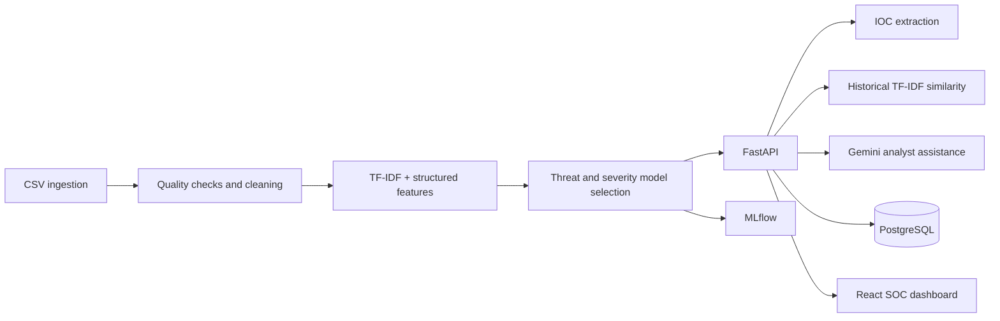

# Cybersecurity Incident Intelligence System

An analyst-support platform that classifies incident threat category and severity using classical machine learning, extracts deterministic indicators, retrieves similar historical events with TF-IDF cosine similarity, and optionally uses Gemini to draft investigation guidance. Gemini never assigns the model category or severity, and never executes response actions.

## Architecture



## Features

- CSV validation, cleaning reports, feature schema, and Plotly EDA.
- Leakage-conscious threat category and severity classification, with Logistic Regression, Random Forest, optional XGBoost, and an optional sparse-projection Keras MLP candidate.
- Seeded stratified train/validation/test partitioning; validation-only model selection followed by one final test evaluation.
- Regex IOC extraction for IP addresses, domains, URLs, CVEs, hashes, MITRE techniques, ports, usernames, and filenames; optional spaCy named entities.
- Historical similarity using TF-IDF and cosine similarity, without embeddings or vector databases.
- FastAPI endpoints, PostgreSQL persistence via psycopg2, SQL migrations, feedback capture, and MLflow logging.
- Gemini JSON-formatted analyst summaries and recommendations, clearly distinct from ML predictions.
- React/Vite analyst dashboard.

## Technology

Python 3.11+, FastAPI, PostgreSQL, psycopg2, Pandas, NumPy, scikit-learn, XGBoost, TensorFlow/Keras candidate builder, spaCy, NLTK-compatible NLP, regex, TF-IDF, MLflow, Google GenAI SDK, Plotly, Joblib, Pytest, React, and Vite. This codebase does not use Transformers, RAG, vector databases, Docker, Kubernetes, or SQLAlchemy.

## Dataset

Put the source at `data/raw/cybersecurity_incidents_10000_final.csv`, or configure `DATASET_PATH`. The repository-root CSV is the supplied source and is never changed. The input may include labels and post-incident fields; the model feature allowlist is in `src/features/feature_schema.py` and the generated `data/processed/feature_schema.json`.

## Setup

```powershell
py -3.11 -m venv .venv
.\.venv\Scripts\Activate.ps1
python -m pip install --upgrade pip
pip install -r requirements.txt
Copy-Item .env.example .env
```

Set PostgreSQL values and, if using Gemini, `GEMINI_API_KEY` in `.env`. Never commit `.env`.

Create the PostgreSQL database `cybersecurity_db` using your PostgreSQL administration tool, then run:

```powershell
python scripts/load_database.py
```

MLflow uses a local SQLite tracking database (`mlflow.db`) and local artifacts by default. Set `MLFLOW_TRACKING_URI` to change it.

## Train and evaluate

```powershell
python scripts/train_pipeline.py
python scripts/evaluate_pipeline.py
python -m src.models.register
```

Training writes quality and cleaning reports under `data/reports/`, the cleaned CSV and feature schema under `data/processed/`, comparison metrics under `data/reports/model_comparison.json`, and selected model artifacts under `models/artifacts/`. Metrics are created by actual runs; no performance values are asserted in advance. Logistic Regression and Random Forest are always candidates. XGBoost, TensorFlow, and MLflow are used when their packages are available. The Keras path applies training-fitted TF-IDF/structured processing followed by a 128-component SVD projection to keep its dense MLP input manageable.

Individual data commands:

```powershell
python -m src.data.ingestion
python -m src.data.cleaning
python -m src.nlp.pipeline
python -m src.eda.analysis
```

## API

Start with `python run.py`, then open `http://127.0.0.1:8000/docs`. Endpoints include:

| Method | Endpoint | Purpose |
|---|---|---|
| GET | `/health` | Service and model readiness |
| POST | `/incidents` | Ingest incident |
| GET | `/incidents` | Incident history |
| GET | `/incidents/{incident_id}` | Incident details |
| POST | `/predict` | ML predictions, entities, and similar events |
| POST | `/analyze` | Prediction + Gemini assistance + persistence |
| POST | `/similar-incidents` | Historical TF-IDF matches |
| POST | `/feedback` | Capture human feedback for review |
| GET | `/models`, `/metrics` | Actual model comparison report |
| GET | `/audit-logs` | Audit history |
| POST | `/llm/summary`, `/llm/investigation`, `/llm/response` | Analyst assistance |

## Frontend

```powershell
cd frontend
npm install
npm run dev
```

Set `VITE_API_URL` to override the API base URL.

## Testing

Run unit tests with `pytest tests/unit`. Integration checks are opt-in: set `RUN_DATABASE_TESTS=1` for a disposable configured database or `RUN_END_TO_END=1` for trained artifacts, PostgreSQL, and Gemini credentials.

## Security and limitations

- Database commands use parameterized SQL; secrets are loaded from environment variables.
- Incident text is treated as untrusted prompt data. Gemini output is schema-checked and advisory only.
- The API is authentication-ready but does not implement authentication. Bind it to a trusted network until organizational auth and authorization are added.
- Similarity results expose historical labels for analyst assistance only; they are not model inputs.
- The optional spaCy entity model and external services require separate setup.
- The supplied dataset has 39 `Low` severity examples; per-class recall and confidence calibration need review before production decisions.
- Results on this dataset are demonstration results, not evidence of performance on live SOC traffic.

## Documentation and structure

See [documentation index](docs/README.md). Source modules separate ingestion, cleaning, EDA, NLP, feature policy, models, similarity, persistence, API, and application services. SQL migrations are under `database/migrations/`; UI code is under `frontend/`; tests are under `tests/`.
