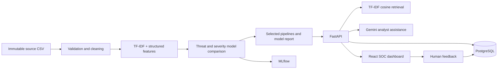

# Architecture

The system has four independently usable layers: CSV/cleaning and EDA, classical NLP and a leakage-controlled sklearn classification pipeline, FastAPI services, and a React analyst console. PostgreSQL persists reviewed analysis and feedback. MLflow records training runs; Gemini supplies analyst-oriented text only.

Model outputs and LLM recommendations are separate fields and display areas. Authentication is an integration point, not implemented; bind to a trusted network and add organizational authentication before deployment.
